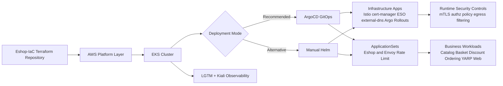

# Eshop Microservices - DevSecOps Application Platform


This repository contains the Kubernetes application and platform layer for the Eshop microservices system.
It is designed to run on top of infrastructure provisioned by the Terraform-based IaC repository.

## Table of Contents

- [Repository Role in the Two-Repo Architecture](#repository-role-in-the-two-repo-architecture)
- [Architecture Snapshot](#architecture-snapshot)
- [What This Repository Deploys](#what-this-repository-deploys)
- [DevSecOps CI/CD in This Repo (GitLab)](#devsecops-cicd-in-this-repo-gitlab)
- [Threat Model (High-Level)](#threat-model-high-level)
- [Prerequisites](#prerequisites)
- [Pre-Deployment Configuration Checklist](#pre-deployment-configuration-checklist)
- [Bootstrap Cluster Access](#bootstrap-cluster-access)
- [Create Required Auth Secrets (AWS Secrets Manager)](#create-required-auth-secrets-aws-secrets-manager)
- [Deployment Option A (Recommended): ArgoCD GitOps](#deployment-option-a-recommended-argocd-gitops)
- [Deployment Option B: Manual Helm (Skip ArgoCD)](#deployment-option-b-manual-helm-skip-argocd)
- [Post-Deployment Validation](#post-deployment-validation)
- [Operational Notes](#operational-notes)
- [Production Hardening Checklist](#production-hardening-checklist)
- [Recommended Next Improvements](#recommended-next-improvements)

## Repository Role in the Two-Repo Architecture

Use the repositories in this order:

1. `Eshop-IaC` (Terraform): provisions AWS foundation resources (EKS, networking, RDS, Amazon MQ, ElastiCache/Valkey, IAM, storage, etc.).
2. `eshop-microservices` (this repo): deploys workloads and platform services into the EKS cluster using GitOps (ArgoCD) or Helm.

This separation keeps infrastructure lifecycle and application lifecycle independent, while preserving full DevSecOps traceability.

## Architecture Snapshot



## What This Repository Deploys

- Business workloads: Catalog, Basket, Discount (gRPC), Ordering, YARP API Gateway, Web Client
- Identity and auth: Keycloak + OpenID Connect integration
- Service mesh and zero-trust controls: Istio + AuthorizationPolicies + egress controls
- GitOps and progressive delivery: ArgoCD + Argo Rollouts
- Secret management: External Secrets Operator + AWS Secrets Manager
- Certificate and DNS automation: cert-manager + external-dns + Route53
- Observability: LGTM stack (Loki, Grafana, Tempo, Mimir, Alloy) + Kiali
- Edge protection: Envoy global rate limiting backed by Redis

## DevSecOps CI/CD in This Repo (GitLab)

Pipeline stages are implemented in `.gitlab-ci.yml` and `.gitlab/ci/*`:

- `secrets-scan`: Gitleaks blocks leaked credentials
- `security-static`: Semgrep, Checkov (IaC), Trivy SBOM, Trivy license checks
- `test`: .NET formatting/tests and client lint/test
- `quality`: SonarQube quality and coverage workflows
- `build`: Docker buildx + Trivy image scan + push on passing gates

Security gates fail the pipeline on critical findings according to configured rules.

## Threat Model (High-Level)

### Primary assets

- Application and platform credentials in AWS Secrets Manager
- Customer/business data traversing APIs, gRPC, and message broker channels
- Cluster control plane and workload identities
- Container images and deployment manifests in CI/CD supply chain

### Main threat vectors

- Secret leakage in source code, CI logs, or misconfigured manifests
- Unauthorized east-west service calls inside cluster network
- Overly broad egress allowing data exfiltration
- Vulnerable or tampered container images reaching runtime
- DNS/certificate misconfiguration exposing endpoints

### Implemented controls in this repository

- Multi-stage security gates in GitLab CI (`gitleaks`, `semgrep`, `checkov`, `trivy`)
- External Secrets Operator for runtime secret injection from AWS Secrets Manager
- Istio `AuthorizationPolicy` and `REGISTRY_ONLY` outbound policy
- cert-manager plus Route53-based DNS automation
- ArgoCD reconciliation with declarative manifests and drift correction
- Envoy gateway rate limiting to reduce abuse and credential stuffing risk

### Residual risks to monitor

- Placeholder development credentials left unchanged in shared environments
- Missing image signing and admission verification policy
- Incomplete production separation if only `dev` ApplicationSet is enabled

## Prerequisites

- AWS account with permissions for EKS, Route53, ACM/cert-manager DNS challenge, and Secrets Manager
- Running EKS cluster already provisioned by the IaC repo
- Tools:
  - `aws` CLI v2
  - `kubectl`
  - `helm` v3
  - `jq` (recommended)
- Access to container registry used by this project

## Pre-Deployment Configuration Checklist

Before deploying, update these files for your environment:

1. Monitoring S3 buckets
   - `helm/monitoring/loki-values.yaml`
   - `helm/monitoring/tempo-values.yaml`
   - `helm/monitoring/mimir-values.yaml`

2. DNS and external access
   - `helm/infra/external-dns.yaml` (`domainFilters`, `txtOwnerId`, region if needed)
   - `helm/monitoring/kiali-values.yaml` (`web_fqdn`, OIDC issuer URLs)
   - `helm/eshop/values-dev.yaml` (`global.domain`, issuer email, hostnames)
   - `helm/ratelimit/values-dev.yaml` (`global.domain`)

3. External dependency endpoints for Istio egress allow-list
   - `helm/eshop/values-dev.yaml`
     - `aws.rds.host`
     - `aws.valkey.host`
     - `aws.amazonmq.host`

4. Optional environment expansion
   - Uncomment stage/prod generators in:
     - `argocd/appsets/eshop-appset.yaml`
     - `argocd/appsets/ratelimit.yaml`

## Bootstrap Cluster Access

```bash
aws eks update-kubeconfig --region us-east-1 --name eshop-eks
kubectl get nodes
```

## Create Required Auth Secrets (AWS Secrets Manager)

These auth secrets are required for External Secrets synchronization in Kubernetes.
Database/cache/message-broker secrets are expected from the IaC/configuration layer.

```bash
export AWS_REGION="us-east-1"

aws secretsmanager create-secret \
  --name "eshop/dev/auth/catalog-api" \
  --description "Identity settings for Catalog API" \
  --secret-string '{"auth_client_id":"reactApp","auth_audience":"reactApp"}' \
  --region "$AWS_REGION"

aws secretsmanager create-secret \
  --name "eshop/dev/auth/basket-api" \
  --description "Identity settings for Basket API" \
  --secret-string '{"auth_client_id":"reactApp","auth_audience":"reactApp"}' \
  --region "$AWS_REGION"

aws secretsmanager create-secret \
  --name "eshop/dev/auth/discount-grpc" \
  --description "Identity settings for Discount gRPC" \
  --secret-string '{"auth_client_id":"reactApp","auth_audience":"reactApp"}' \
  --region "$AWS_REGION"

aws secretsmanager create-secret \
  --name "eshop/dev/auth/ordering-api" \
  --description "Identity settings for Ordering API" \
  --secret-string '{"auth_client_id":"reactApp","auth_audience":"reactApp","kc_client_id":"ordering-service","kc_client_secret":"CHANGE_ME"}' \
  --region "$AWS_REGION"

aws secretsmanager create-secret \
  --name "eshop/dev/auth/yarp-api-gateway" \
  --description "Identity settings for YARP API Gateway" \
  --secret-string '{"auth_client_id":"reactApp","auth_audience":"reactApp"}' \
  --region "$AWS_REGION"

aws secretsmanager create-secret \
  --name "eshop/dev/auth/web-client" \
  --description "Identity settings for Web Client" \
  --secret-string '{"auth_client_id":"reactApp","auth_audience":"reactApp"}' \
  --region "$AWS_REGION"

aws secretsmanager create-secret \
  --name "eshop/dev/auth/keycloak-svc" \
  --description "Keycloak bootstrap admin credentials" \
  --secret-string '{"username":"admin","password":"admin"}' \
  --region "$AWS_REGION"
```

Security note: rotate default credentials and replace placeholder secrets before production use.
If a secret already exists, replace `create-secret` with `put-secret-value` for idempotent updates.

## Deployment Option A (Recommended): ArgoCD GitOps

Use this when you want declarative sync, drift self-healing, and centralized operations.

### 1) Bootstrap ArgoCD project and root app

```bash
kubectl apply -f ./argocd/projects/eshop-project.yaml
kubectl apply -f ./argocd/root.yml
```

### 2) Access ArgoCD and Grafana credentials

```bash
kubectl -n argocd get secret argocd-initial-admin-secret \
  -o jsonpath="{.data.password}" | base64 -d; echo

kubectl get secret --namespace monitoring grafana \
  -o jsonpath="{.data.admin-password}" | base64 --decode; echo

kubectl port-forward -n argocd svc/argo-cd-argocd-server 8080:443
```

ArgoCD then manages:

- Infrastructure apps (Istio, cert-manager, external-dns, ESO, Argo Rollouts, monitoring stack)
- ApplicationSets for environment-specific Eshop and rate-limit deployments

## Deployment Option B: Manual Helm (Skip ArgoCD)

Use this for direct control or troubleshooting. If you choose this path, skip ArgoCD bootstrap commands.

### 1) Add Helm repositories

```bash
helm repo add istio https://istio-release.storage.googleapis.com/charts
helm repo add external-dns https://kubernetes-sigs.github.io/external-dns
helm repo add jetstack https://charts.jetstack.io
helm repo add external-secrets https://charts.external-secrets.io
helm repo add argo https://argoproj.github.io
helm repo add grafana https://grafana.github.io
helm repo add kiali https://kiali.org/helm-charts
helm repo update
```

### 2) Install platform dependencies

```bash
helm install istiod istio/istiod \
  -n istio-system --create-namespace \
  --set meshConfig.outboundTrafficPolicy.mode=REGISTRY_ONLY \
  --version 1.28.0

helm install external-secrets external-secrets/external-secrets \
  -n external-secrets --create-namespace --version 1.2.0

helm install cert-manager jetstack/cert-manager \
  --namespace cert-manager --create-namespace \
  --set crds.enabled=true --version v1.19.2

helm upgrade -i external-dns external-dns/external-dns \
  --namespace kube-system \
  -f helm/infra/external-dns.yaml \
  --version 1.14.3

helm upgrade -i argo-rollouts argo/argo-rollouts \
  -n argo-rollouts --create-namespace \
  -f helm/infra/values-rollouts.yaml \
  --version 2.40.5
```

### 3) Install monitoring stack

```bash
helm upgrade -i loki grafana/loki \
  -f helm/monitoring/loki-values.yaml \
  -n monitoring --create-namespace --version 6.49.0

helm upgrade -i tempo-distributed grafana/tempo-distributed \
  -f helm/monitoring/tempo-values.yaml \
  -n monitoring --version 1.60.0

helm upgrade -i mimir-distributed grafana/mimir-distributed \
  -f helm/monitoring/mimir-values.yaml \
  -n monitoring --version 6.0.5

helm upgrade -i alloy grafana/alloy \
  -f helm/monitoring/alloy-values.yaml \
  -n monitoring --version 1.5.1

helm upgrade -i grafana grafana/grafana \
  -f helm/monitoring/grafana-values.yaml \
  -n monitoring --version 10.4.2

helm upgrade -i kiali-server kiali/kiali-server \
  -f helm/monitoring/kiali-values.yaml \
  -n kiali-operator --create-namespace --version 2.22.0
```

### 4) Install rate-limiting and business workloads

```bash
helm upgrade -i envoy-ratelimit helm/ratelimit \
  -f helm/ratelimit/values-dev.yaml \
  --set global.ns=true

helm upgrade -i eshop-dev helm/eshop/ \
  -f helm/eshop/values-dev.yaml \
  --set global.ns=true
```

## Post-Deployment Validation

```bash
kubectl get pods -A
kubectl get httproutes -A
kubectl get gateway -A
kubectl get externalsecret -A
kubectl get certificates -A
kubectl get virtualservice,destinationrule,authorizationpolicy -A
```

For GitOps deployments, also verify ArgoCD health:

```bash
kubectl get applications -n argocd
```

## Operational Notes

- Istio is configured with `REGISTRY_ONLY` egress mode; only declared destinations are reachable.
- Egress access for AWS services is controlled through ServiceEntry resources generated from chart values.
- Envoy rate limiting is applied at gateway level using dedicated descriptors per host category (`api`, `app`, `id`).
- Argo Rollouts is integrated for progressive delivery patterns (canary/blue-green strategies).
- Kiali is integrated with OIDC and LGTM telemetry backends for service graph and traffic analysis.

## Production Hardening Checklist

- [ ] Replace all bootstrap/demo credentials and rotate on a defined schedule
- [ ] Use per-environment AWS accounts or strict IAM boundaries for `dev`, `stage`, `prod`
- [ ] Enforce container image signing (Cosign) and admission verification (Kyverno/Gatekeeper)
- [ ] Add Kubernetes Pod Security standards and deny privileged containers by policy
- [ ] Enable runtime alerting for anomalous service-to-service calls and egress spikes
- [ ] Add WAF/rate-limit policies at edge ingress in addition to gateway-level controls
- [ ] Configure backup and retention policies for persistent components and secrets metadata
- [ ] Enable stage/prod ApplicationSet entries with approval gates and promotion strategy
- [ ] Run regular dependency and base image update cadences with automated pull requests
- [ ] Document and test incident response playbooks (credential leak, pod compromise, rollback)

## Recommended Next Improvements

- Replace hardcoded development credentials with per-environment rotated secrets.
- Add stage/prod value files and enable full multi-environment ApplicationSet rollout.
- Add smoke tests as a post-deploy GitLab stage for synthetic end-to-end validation.
- Enforce signed container images and admission verification for stronger software supply chain security.
